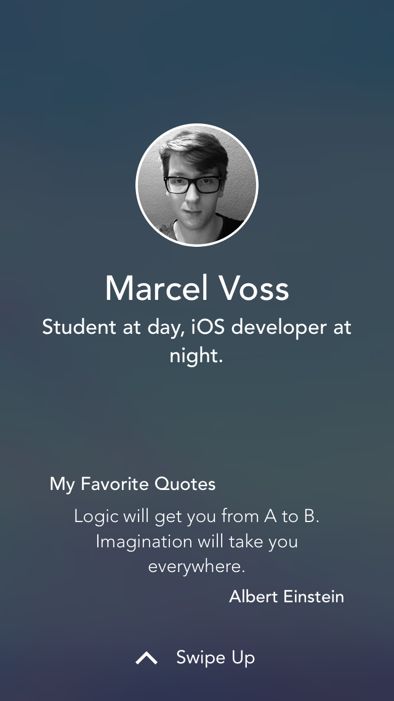
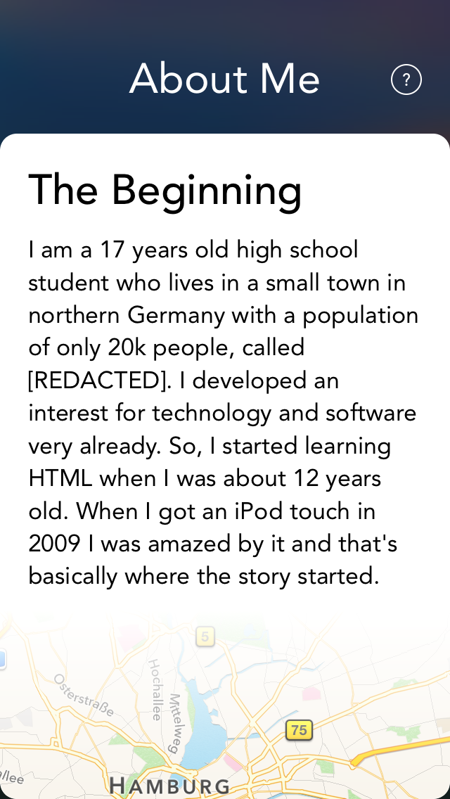
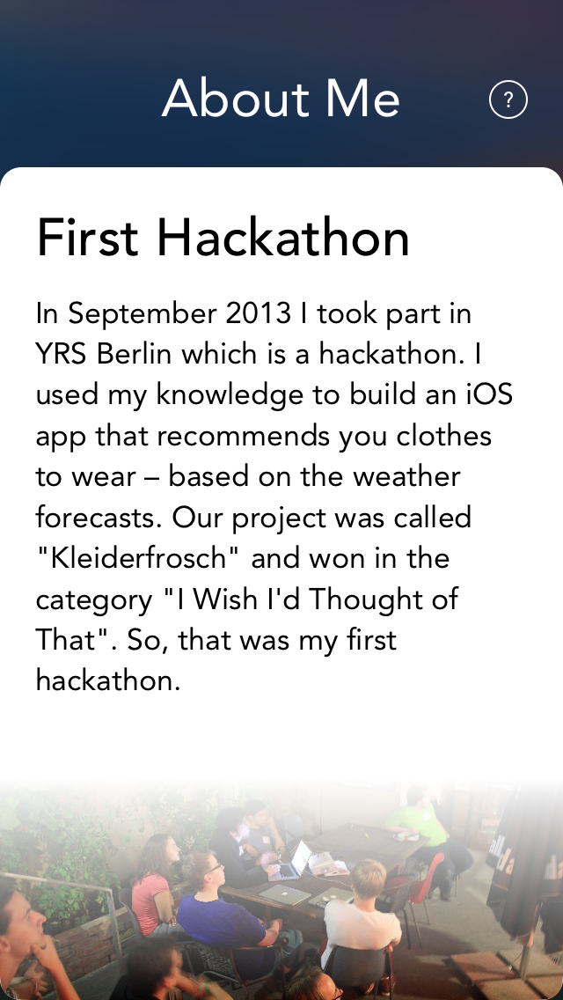

# WWDC15-Scholarship

I was accepted!

This is the application I created for the WWDC 2015 scholarship. Please notice that I had to censor some information about me. Also sorry for the rough code. :(

I made use of a modified version of [@BalestraPatrick's](https://github.com/BalestraPatrick) skill progress bar.

## Preview

[Here'a a video](https://vimeo.com/126154527) if you want to see it in action.

## License
This project is available under the Unlicense. See the [LICENSE](https://github.com/marcelvoss/WWDC15-Scholarship/blob/master/LICENSE.md) file for more information. So, you're allowed to do anything you want with it.